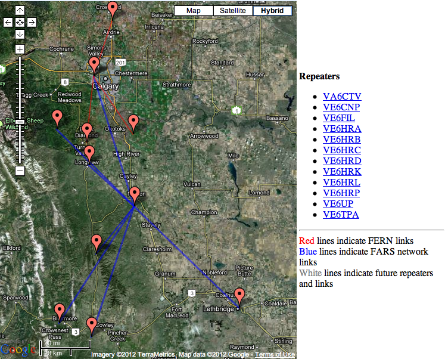

# Foothills Amateur Radio Repeaters

## Repeaters

- VE6HRA Aldersyde/Gladys Ridge 147.000+ (CTCSS 110.9 Hz)
- VE6HRB Nanton 145.170
- VE6HRC Millarville 145.190
- VE6HRL Longview 145.370
- VE6HRK Burton Creek 145.430
- VE6HRP Burmis 145.390
- VA6CTV Calgary 145.290
- VE6CNP Crowsnest Pass 145.490
- VE6UP Lethbridge 147.150
- VE6TPA Crossfield 147.135

---

## Contact

East Kootenay Amateur Radio Club
132 Grandview Place Cranbrook BC

Website Maintained by VE7QQ

EKARC is a RAC Affiliated Club

Copyright © East Kootenay Amateur Radio Club
