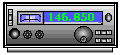
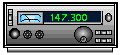

# East Kootenay Amateur Radio Club

Welcome to the East Kootenay Amateur Radio Club website!

The East Kootenay Amateur Radio Club was established in 1935. We are the only local radio club that is an integral part of the Regional District of East Kootenay (RDEK) Emergency Management Plan.

Along with enjoyment of the Ham Radio hobby, we provide and maintain an emergency communication system that covers the cities, towns, and rural areas of the RDEK, from Cranbrook to Golden, Creston to Sparwood.

EKARC will never solicit monetary support from the residents of the East Kootenays. Additionally, EKARC is not, in any way whatsoever, affliated with the Cranbrook Radio Club Society (CRCS).

---

## Check our News/Events page for recent updates

[HERE](news-events.md)

(last updated 2026-01-12)

## Check our photo gallery for recent updates

[HERE](photo-gallery.md)

(last updated 2024-05-06)

---

## Join our nets!

Join us for our 2 metre FM net every Thursday night at 20:00 Mountain Time on the repeaters listed below!

Join the province-wide DMR net on BC1 every Friday night at 21:00 Mountain Time - check for your call [here](http://primary.bctrbo.net/CallWatch?filter=BC)!

Join the local VHF simplex sideband net Sunday mornings at 10:00 Mountain Time on 144.200 MHz USB!

## Repeaters

### VE7CAP - Cranbrook/Kimberley

- Analog FM: 146.940 MHz (-0.600 MHz input, 88.5 Hz tone)
- DMR: 443.550 MHz +5 MHz offset, TG: 30271, TS: 1, CC: 1

### VE7RIN - Fairmont/Invermere

- Analog FM: 146.850 MHz (-0.600 Mhz input, 88.5 Hz tone)
- DMR: 443.850 MHz +5 MHz offset, TG: 30271, TS: 1, CC: 1

### VE7RCA - Creston/Kootenay Lake

- 146.800 MHz (-0.600 MHz input, 88.5 Hz tone)

### VE7RSQ - Sparwood/Crowsnest

- 147.300 (+0.600 MHz input, 100 Hz tone)

---

## Club Events Calendar

<iframe src="https://calendar.google.com/calendar/embed?height=500&amp;wkst=1&amp;bgcolor=%23ffffff&amp;ctz=America%2FEdmonton&amp;showTitle=0&amp;showCalendars=0&amp;showTabs=0&amp;src=dmU3cXFAZWthcmMuY2E&amp;color=%23039BE5" style="border:solid 1px #777" width="85%" height="500" frameborder="0" scrolling="no"></iframe>

---

## Why HAM Radio?

This is a question that comes up all the time. Why, or how, in the 21st century, and with technology like cellular networks, is HAM radio still relevant? There are a myriad of reasons.

If you are currently a licensed amateur radio operator, or are interested in becoming one, please contact us. We can be reached at contact@ekarc.ca or come out to one of our meetings!

---

## Acknowledgements

The East Kootenay Amateur Radio Club would like to thank the Regional District of East Kootenay for their continued support, which allows us to provide Emergency Radio Communications for the communities of the East Kootenays.

The East Kootenay Amateur Radio Club would also like to thank the Rotary Club of Cranbrook for their support.

The East Kootenay Amateur Radio Club would also like to acknowledge that we are grateful to be able to conduct our activities within the traditional territory of the Ktunaxa Nation.

---

## Mission Statement

Since 1935 the mission of the East Kootenay Amateur Radio Club is to promote the technical knowledge and use of amateur radio through training, mentoring, community service and enhancing fellowship among radio amateurs.

---

## Contact

East Kootenay Amateur Radio Club
132 Grandview Place Cranbrook BC

Website Maintained by VE7QQ

EKARC is a RAC Affiliated Club

Copyright © East Kootenay Amateur Radio Club
