# EKARC NEWS AND EVENTS

---

## 2026-01-12 - SAVE THE DATE - EKARG GENERAL MEETING

Please join us for a special Business Meeting on Saturday, February 21st at 14:00 MDT at VE7LOC's QTH - We will be discussing proposed updates to our club constitution.

Contact our [Club Secretary](mailto:secretary@ekarc.ca) for more information.

---

## 2025-09-04 - SAVE THE DATE - EKARG GENERAL MEETING

Please join us for our bi-monthly Business Meeting on Saturday, September 13 at 14:00 MDT at VE7LOC's QTH

Contact our [Club Secretary](mailto:secretary@ekarc.ca) for more information.

---

## 2025-06-22 - SAVE THE DATE - ARRL FIELD DAY

The East Kootenay Amateur Radio Club will once again be participating in the annual ARRL Field Day event - to be held this year on June 28th and 29th. We will be operating from Idlewild Park in Cranbrook (off 9th street and 34th avenue, coordinates: 49.4997575 N, -115.7351009 W) starting at noon on the 28th.

Feel free to come out and try your hand at operating either HF or VHF, from one of the stations set up for the event. We will also be having our yearly club BBQ, with food services provided by the Salvation Army.

---

## 2024-10-24 - SAVE THE DATE - EKARC CHRISTMAS LUNCHEON

Please join us for our yearly Christmas gathering, on Saturday, December 14th at 13:00 MST at the Lucky Star Restaurant (17 12th Ave S, Cranbrook)

[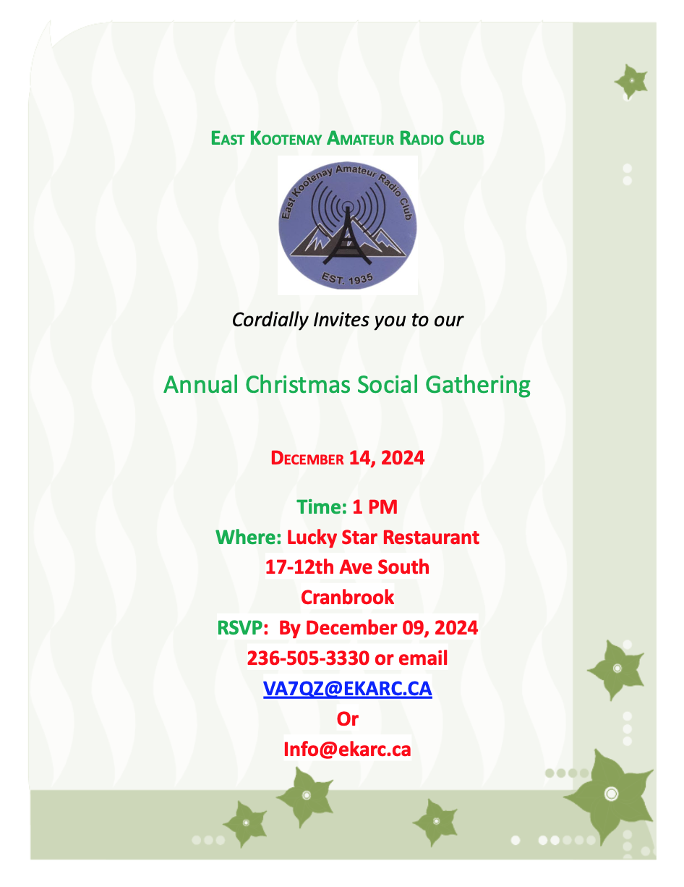](documents/EKARC_XmasInvite.pdf)

Click the invite above, or contact our [Club Secretary](mailto:secretary@ekarc.ca) for more information.

---

## 2024-10-15 - SAVE THE DATE - EKARC GENERAL MEETING

Please join us for our bi-monthly General Meeting on Tuesday, October 22nd at 19:30 MDT on ZOOM

Contact our [Club Secretary](mailto:secretary@ekarc.ca) for more information.

---

## 2024-08-29 - SAVE THE DATE - EKARC BUSINESS MEETING

Please join us for our bi-monthly Business Meeting on Saturday, September 21 at 14:00 MDT at VE7LOC's QTH

Contact our [Club Secretary](mailto:secretary@ekarc.ca) for more information.

---

## 2024-06-13 - SAVE THE DATE - ARRL FIELD DAY

Once again, EKARC is participating in ARRL Field Day, to be held this year at Idlewild Park in Cranbrook, Saturday, June 22nd to Sunday, June 23rd, 2024. This is a great opportunity to try your hand at operating portable HF or VHF - in the great outdoors!

Contact our [Club Secretary](mailto:secretary@ekarc.ca) for more information.

---

## 2024-05-06 - SAVE THE DATE - EKARC BUSINESS MEETING

Please join us for our bi-monthly Business Meeting on Tuesday, May 14 @ 19:30 MDT, to be held via ZOOM

Contact our [Club Secretary](mailto:secretary@ekarc.ca) for more information.

---

## 2024-02-02 - SAVE THE DATE! EKARC SOCIAL MEETING

Please join us for our bi-monthly "Coffee Klatch" on Saturday, February 17, 2024 @ 1400 MST, to be held at VE7LOC's QTH

There will be a discussion (and possibly demonstration) about QRP HF radio.

Contact our [Club Secretary](mailto:secretary@ekarc.ca) for more information.

---

## 2024-01-26 - RDEK Honorary Membership Presentation

As a show of our appreciation for their ongoing support, the East Kootenay Amateur Radio Club had the pleasure of presenting the Regional District of East Kootenay with an honorary membership to the club. A tour of the Tom Haverko Radio Room was also provided.

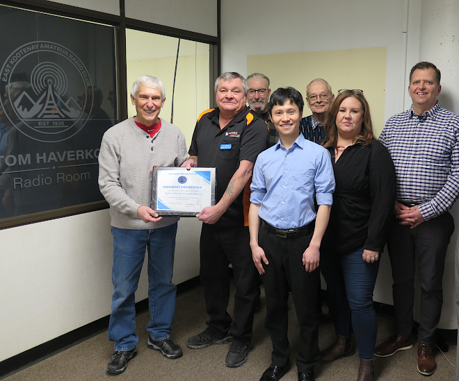

Pictured above, left to right: Rob Gay RDEK Board Chair, Doug Newberry EKARC President, Brian Veitenheimer EKARC Vice President, Gilbert Chan RDEK Emergency Program Coordinator, Lance Cuthill EKARC Past President, Christina Carbrey RDEK Protective Services Manager, Terry Balan RDEK WildFire Resiliency Supervisor. Missing from Photo: Simran Sandhu RDEK Emergency Program Coordinator

---

## 2024-01-14 - SAVE THE DATE! EKARC BUSINESS MEETING

Please join us for our bi-monthly "Business Meeting" on Saturday, January 20th 2024 @ 1400 MDT, to be held in person at the Cranbrook Seniors Hall, 125 17th Ave S.

There will be several items up for discussion, so please attend if you are able.

Contact our [Club Secretary](mailto:secretary@ekarc.ca) for more information.

---

## 2023-11-12 - SAVE THE DATE! EKARC BUSINESS MEETING

Please join us for our bi-monthly "Business Meeting" on Tuesday, November 14, 2023 @ 1930 MDT, to be held online via Zoom

There will be several items up for discussion, so please attend if you are able.

Contact our [Club Secretary](mailto:secretary@ekarc.ca) for more information.

---

## 2023-09-26 - HAM RADIO COURSE

Due to popular demand, we are holding another Amateur Radio Operator Course, to be held at the RDEK Emergency Operations Center in Cranbrook BC.

Please click on the flyer below for more information:

[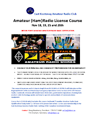](images/ekarc_course.png)

---

## 2023-09-25 - SAVE THE UPDATED DATE! EKARC SOCIAL MEETING

Please join us for our bi-monthly "Social Meeting" on Saturday October 21, 2023 @ 1400 MDT at Lance Cuthill's QTH, 4300 Wilks Rd in Cranbrook.

Gavin VE7GSJ will be giving a presentation on DMR, which should answer a lot of questions about our new DMR repeater in the Invermere area.

Contact our [Club Secretary](mailto:secretary@ekarc.ca) for more information.

---

## 2023-09-25 - REPEATER UPDATES!

Some exciting news: we now have a DMR repeater at VE7RIN! A huge thanks to the Repeater Committee and all involved for making this a reality.

Frequency is 443.850 MHz, +5.0 MHz input. Slot 1 is TalkGroup 30271, "BC 1"

---

## 2023-09-11 - Cranbrook Rotary Club Donation

The East Kootenay Amateur Radio Club would like to thank the Cranbrook Rotary club for their generous donation towards the maintenance and upkeep of the EKARC's radio system. This will go a long way to help our club with offsetting operational costs.

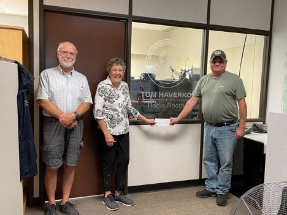

Left: Wayne Mercer VA7BUP club member, Center: Sandy Zeznik Cranbrook Rotary Club
Right: Doug Newberry VA7QZ President East Kootenay Amateur Radio Club.

---

## 2023-07-03 - ARRL Field Day 2023

EKARC once again has participated in ARRL Field Day. Organized by Brian VA7VEB and Doug VA7QZ, our event this year was a huge success. We completed over 200 separate contacts, using HF, VHF, Digital HF, Email via HF Winlink and VARA modes, for a preliminary score of 1502 points, all while operating off of battery/solar power.

Photos to come!

---

## 2023-02-27 - Basic Amateur Radio Course/Exam 2023

On February 18 and 25th, 2023, our club's resident Accredited Examiner, Lance Cuthill VE7LOC (along with assistance from Doug Newberry VA7QZ and Brian Veitenheimer VA7VEB) ran a very successful Canadian Amateur Radio Operator course. There were 10 attendees present, and six passed the exam and the remaining four intend to re-write in the next month or so. Many thanks to the Regional District of East Kootenay for allowing us the use of their Emergency Operations Centre to hold the course.

Some photos from the event, courtesy of Doug Newberry VA7QQ:

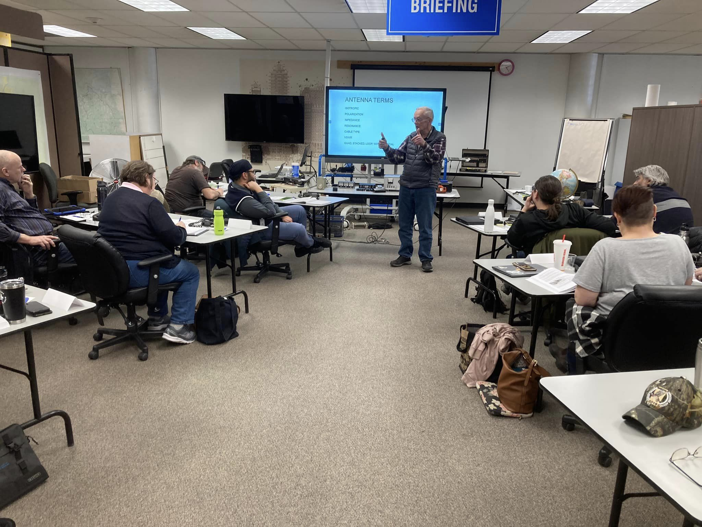
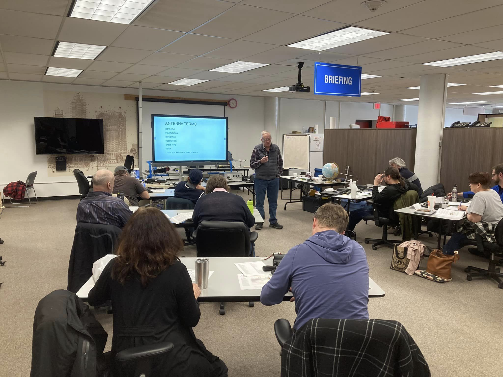
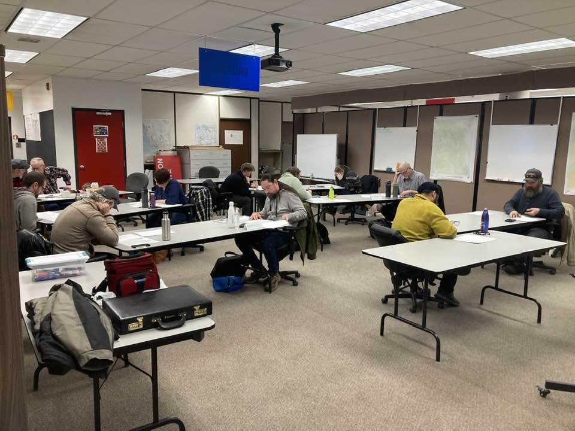

---

## 2022 - Joe Rieberger VE7CRJ - Celebration of Life

On July 2nd, 2022, a Celebration of Life was held for long-time club member Joe Rieberger VE7CRJ. An excellent tribute to Joe can be found here:
https://www.markmemorial.com/obituary/joseph-rieberger/

Some photos from the event, courtesy of Doug Newberry VA7QZ:

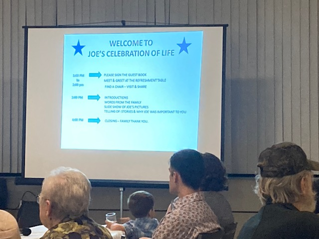
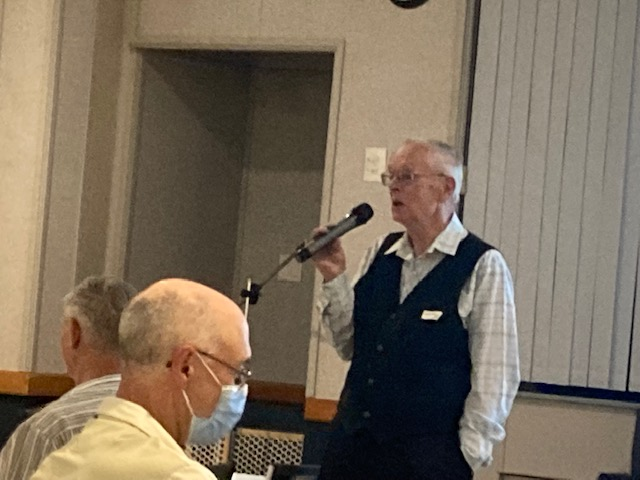
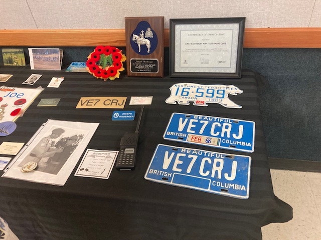

---

## 2022 - ARRL Field Day 2022

Our club's Vice President, Brian Veitenheimer VA7VEB took charge on the club's entry into the ARRL Field Day contest this year. He operated as VE7IP, and overall, the event was a great success. Per Brian:

Great weekend. About 120 contacts made which was good considering conditions. Some large clubs only managed 600 so I was quite happy with our total.

The 31' rotateable 20-15-10m dipole made from salvaged hang glider tubing worked fantastic.

VA7QZ supplied a small fold up vertical mounted to the RVs ladder that performed amazing on 40 and 80m. The area provided a zero noise level even on the lower bands.

We had a wonderful time with 1/2 a dozen members dropping in.

The rancher who leases the land was very interested and accommodating.

Our little wiener dog had a busy weekend interacting with the local gophers and squirrels. My spouse loved the relaxing downtime.

Overall a great success and hoping with more participation next year. I learned a lot.

VA7VEB.

Some photos from the event:

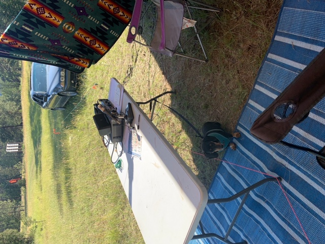
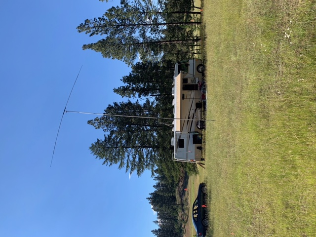
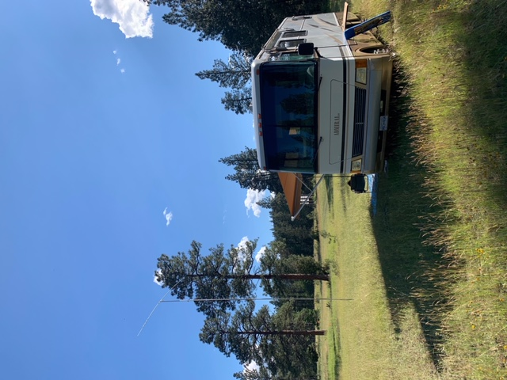
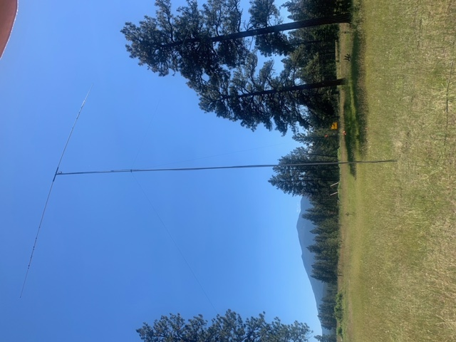
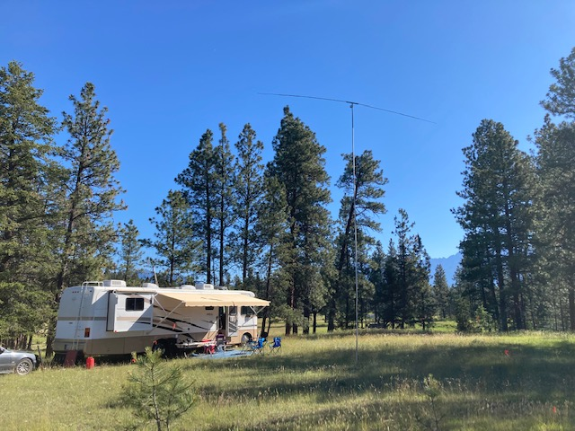

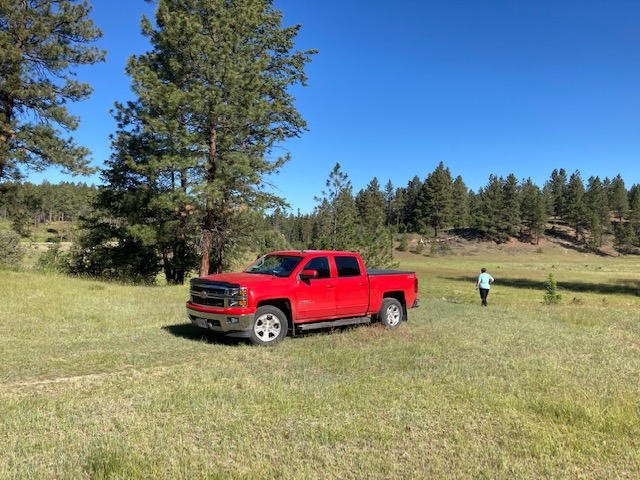

---

## 2022 - AGM Meeting - April 23, 2022

On April 23rd we will be holding our AGM and voting in the new executives at that time.

We will post the positions that have been filled and we will also have the contact info available for the new executive.

**Please Note:** In order to vote for the new executives you must be a member in good standing with your dues paid in full for 2022.

- President: Doug Newberry VA7QZ
- Vice President: Brian Veitenheimer VA7VEB
- Treasurer: Gavin Jacobs VE7GSJ
- Secretary: Tim Graham VE7QQ

---

## 2021 - AGM Meeting - April 27, 2021

On April 27th we will be holding our AGM and voting in the new executives at that time.

We will post the positions that have been filled and we will also have the contact info available for the new executive.

**Please Note:** In order to vote for the new executives you must be a member in good standing with your dues paid in full for 2021.

- President: Doug Newberry VA7QZ
- Vice President: Kevin Lewis VA7KJL
- Secretary: Tim Graham VE7LXC
- Treasurer: Gavin Jacobs VE7GSJ

---

## EKARC and RDEK Jamboree on the Air

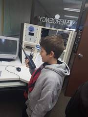

The East Kootenay Amateur Radio Club (EKRAC) in partnership with the Regional District of the East Kootenays (RDEK) enabled the Cranbrook 4Th Cub Scout group join the annual Scout JOTA (Jamboree on The Air).

The Jamboree on the Air or JOTA is an annual scouting event that uses amateur radio to link scouts around the world, around Canada and in their own community. Held on the third full weekend in October, this world-wide jamboree requires no travel, other than to a nearby amateur radio shack, Scout meeting place, camp or community center.

The RDEK opened the doors of its EOC (emergency operations center) October 21, 2018 to allow the radio operators and members of the EKARC to operate their emergency communication equipment located in the EOC and get the Cub Scouts on the air. The operators on hand were VE7DNG (Doug) and VE7MRP (Dan)

Although the Cub Scouts had only a few opportunities to talk to other Scouts, several ham radio operators from around the globe, gave the Cub Scouts an opportunity to experience radio communications that can span the world. A great time was had by one and all. Big Thanks to Terry Balan RDEK EOC Director.

The EKARC (East Kootenay Amateur Radio Club) is the second oldest radio club in North America and was established in 1935. The club is an integral part of the RDEK EOC and volunteers from the EKARC man the Emergency Communication Center anytime the EOC is activated. The EKRAC was on site at the EOC during the Wildfire season of 2018.

If you are currently a licensed ham radio operator or would like to be one or you are interested in experiencing the world-wide communication this hobby can offer, please contact us. We can be reached at contact@ekarc.ca or come out to one of our meeting held every second Saturday of the month at 4300 Wilks In Cranbrook.

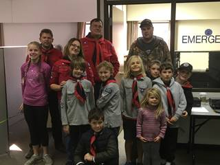

---

## Digital DMR Repeater Available for Use

### The repeater name is VE7DCX

It is a digital DMR repeater which is owned and operated by Dan Cameron VE7MRP and is located in Kimberley BC

- 70cm
- 443.75000
- 448.75000
- +5.0 MHz
- DMR CC 1
- BrandMeister
- BC1 30271 full time on time slot 1. Time slot 2 = Montana 31302, Washington1 3153, or whatever BrandMeister TG you want. Please use slot 2 for dynamic talk groups.
- 0.2 Miles south
- DN29AP
- Kimberley, BC
- Canada

---

## Contact

East Kootenay Amateur Radio Club
132 Grandview Place Cranbrook BC

Website Maintained by VE7QQ

EKARC is a RAC Affiliated Club

Copyright © East Kootenay Amateur Radio Club
